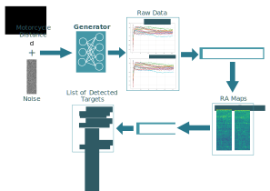

# Raw Radar Data Generation
---

This repository is the the code used in the paper: Generation of Realistic Synthetic Raw Radar Data for Automated Driving Applications using Generative Adversarial Networks. Above there a summary of this method.



## Instalation
---
```console
$ git clone <repository>
```
## Usage
---


### Preprocessing 
In order to perform the training is necessary preprocess the data, that are in h5 file. For this run all the jupyter netebook:
```console
save_prerpocessed_chirps_labels.ipynb
```
This notebook will parse the data to numpy array and apply the change of scales. At the end of the execution will have one `.npy` file with the chirps data and other with the labels.

### Training the model
Use thte follow script to train the model.
```console
python src/models/trainings/train_conditional.py
```
This code uses the Weights & Bias API.

### Saving the generations
To save the generations in a numpy file.
```console
python src/generate/save_conditional.py
```

### Saving RA maps
To save RA maps as png files.
```console
python src/generate/save_ramaps.py
```